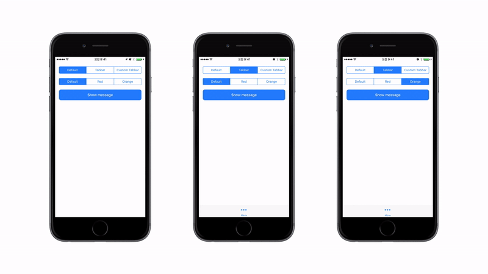

# GCNotificationView

[](http://cocoapods.org/pods/GCNotificationView)
[](http://cocoapods.org/pods/GCNotificationView)
[](http://cocoapods.org/pods/GCNotificationView)
[](https://developer.apple.com/swift/)

## Update Note

`GCNotificationView` now provides you to customize following things.
* Text color
* Delay
* Duration

## Intoduction

`GCNotificationView` is simple but very useful toast message view for iOS. You can easily set message and show it to user with a single method call. You can change it's location wherever you want.



## Example

To run the example project, clone the repo, and run `pod install` from the Example directory first.

## Requirements

`GCNotificationView` is written in Swift 3. Compatible with iOS 8.0+

## Installation

`GCNotificationView` is available through [CocoaPods](http://cocoapods.org). To install
it, simply add the following line to your Podfile:

```ruby
pod "GCNotificationView"
```

## Usage

First you need to import `GCNotificationView`

```swift
import GCNotificationView
```

Then all you need to do to use `GCNotificationView` is simply call the method with your message.


```swift
GCNotificationView().show(message: "Hello, World!")
```

Or you can customize toast view with your own favor.

```swift
// Customize notification view on initialize
var notificationView = GCNotificationView()
notificationView.duration = 0.3
notificationView.delay = 3.0
notificationView.yPoint = 0.0
notificationView.bgColor = .orange
notificationView.textColor = .white

notificationView.show(message: "Hello, World!")

// Customize notification view on show
GCNotificationView()
    .change(duration: 0.3)
    .change(delay: 3.0)
    .change(yPoint: 0.0)
    .change(bgColor: .orange)
    .change(textColor: .white)
    .show(message: "Hello, World!")
```

Done! Super easy and super simple.

These are the variables you can customize. If you don't mention these variables, it will automatically set as default values.

```swift
var duration: Double    // Time in second for toast to animating (Default is 0.3)
var delay: Double       // Time in second for toast to present (Default is 3.0)
var yPoint: CGFloat     // Position of the toast view on y-axis (Default is 0)
var bgColor: UIColor    // Background color of toast view (Default is light blue)
var textColor: UIColor  // Message color of toast (Default is white)

// Supports various initialization
GCNotificationView()
GCNotificationView(duration: 0.3, yPoint: 0)
GCNotificationView(delay: 3.0, yPoint: 0)
GCNotificationView(duration: 0.3, delay: 3.0, yPoint: 0)
```

## Author

Junho, dangercloz@gmail.com

## License

GCNotificationView is available under the MIT license. See the LICENSE file for more info.
